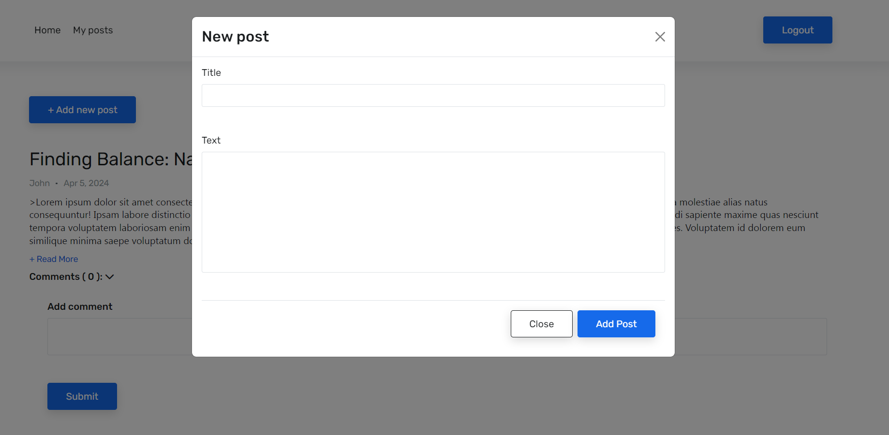
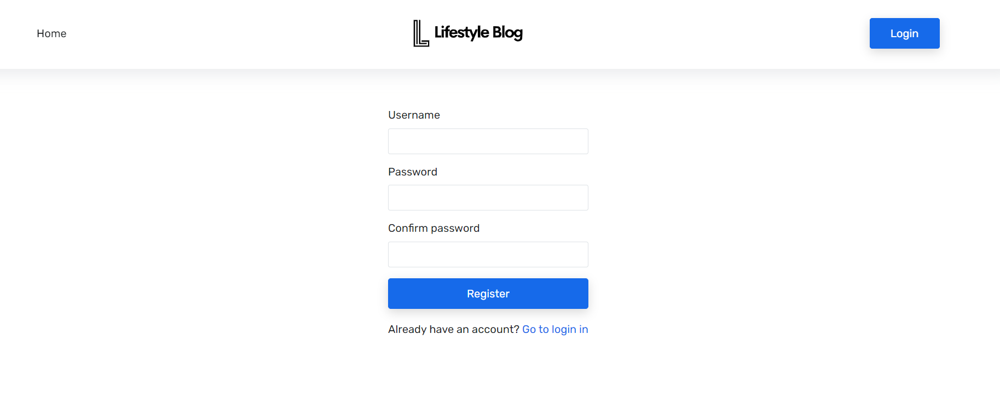
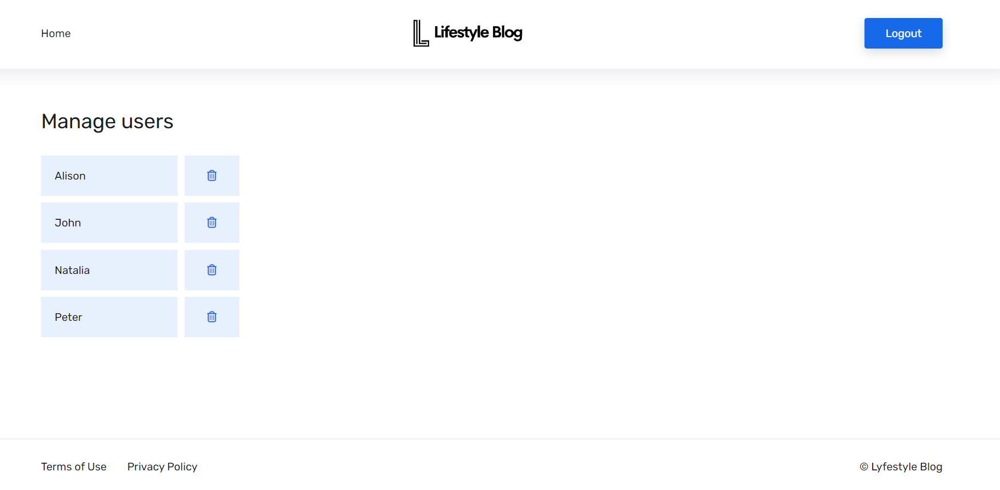

# Microblog Service

Microblog Service is a project developed for educational purposes, implementing a microblogging platform. It allows users to register, login, create posts, leave comments, and perform other actions. The project is built using Node.js with Express for the backend, MongoDB with Mongoose for the database, and EJS as the templating engine for server-side rendering (SSR).

The project is deployed using MongoDB Atlas for the database and Render.com for deployment. Additionally, various npm packages have been utilized to enhance functionality, such as Morgan, Yup and Jsonwebtoken.

## Features

- User Authentication: Users can register, log in, and log out securely.
- Post Creation: Users can create posts to share their thoughts.
- Commenting System: Users can leave comments on posts.
- Post and Comment Management: Users can delete their own posts and comments.
- User Profile Page: Authenticated users have access to a page displaying only their posts.
- Admin Panel: An admin panel is available for deleting existing users.

## Tech Stack

- Node.js with Express for the backend
- MongoDB with Mongoose for database management
- EJS as the templating engine for server-side rendering
- Morgan for logging
- Yup for data validation
- Jsonwebtoken for authentication

## Screenshots

_Home_

_My posts_

_Sign up_

_Admin page_

## Getting Started

1. Clone the repository.
2. Install dependencies: `npm install`.
3. Set up a MongoDB database and configure the connection in the project.
4. Configure proper environment variables.
5. Start the server: `npm start`.
6. Access the application through the provided URL.
